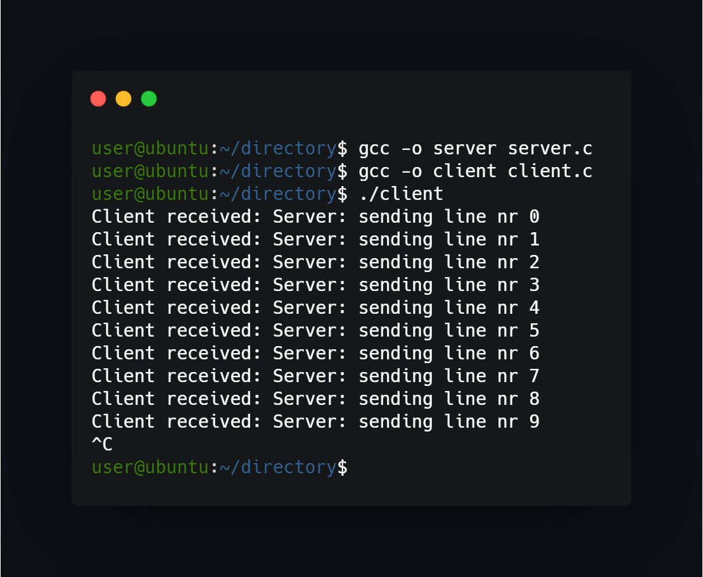
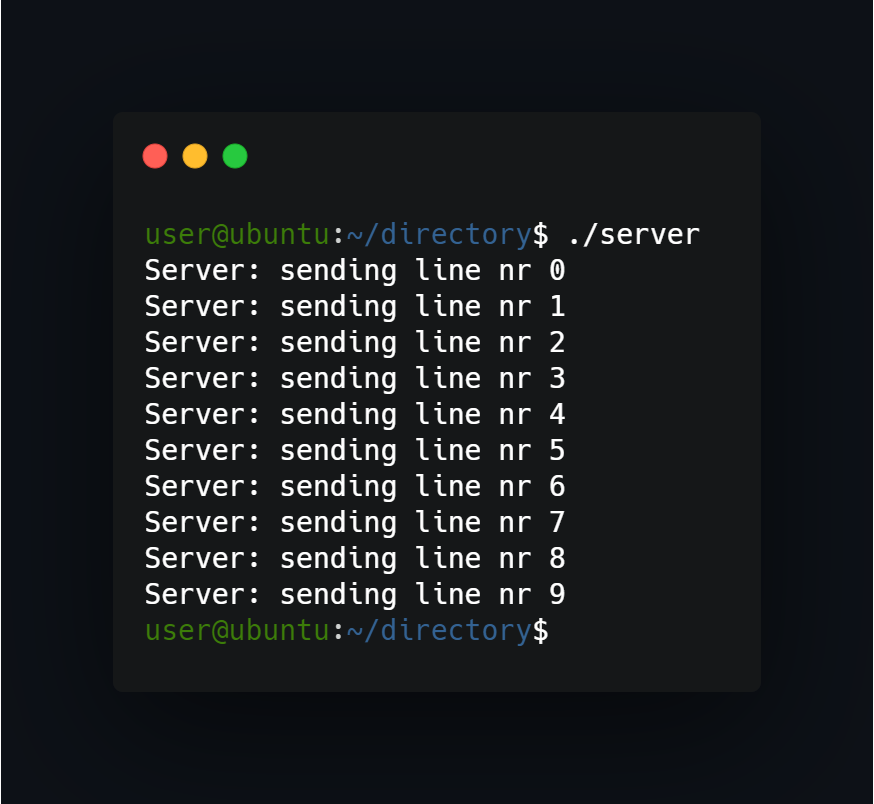

## What project do?
Programs are client and server that communicate with each other through FIFO file in NON_BLOCK mode.




## How to use?
Just compile and run in separate terminals:
```
gcc -o client client.c
gcc -o server server.c
./client
```
In second terminal:
```
./server
```

## Possible problems
While running program multiple times can occur problem with FIFO file, then file becomes unresponsive to writing/reading (because it was created by other program instance). Then deleting myfifo file form /tmp/myfifo will help, because program creates new file with every execution.


<!--https://banner.godori.dev/ height:150-->
<!--https://shields.io/-->
<!--https://carbon.now.sh/-->